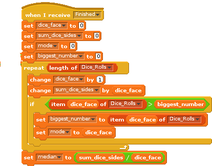

# Introduction

Extend the dice shaker from last week, we will investigate the mean, median and mode of a six sided dice thrown many times. Scratch will pick a random number between 1 and 6 and we will store the number of times each number appears. We are going to store the total number of rolls  in our list and then use the data inside the list to calculate the mean, median and mode of the dice rolls.

# Step 1: Random number generator

## Activity Checklist

+ Load the 6 sided dice roll from last week. ☐
+ The code should look something like: ☐

## Test your project

We should check our code from last week still works. Click the green flag.

+ Do you get the expected *distribution* of dice rolls? _______________

## Save your project

# Step 2: Calculate the mean.

To calculate the mean,  we add all the rolls we have made up and then divide by the number of rolls. e.g. we roll a 5, a 1 and a 3. The mean is 5 + 1 + 3 divided by 3 = 9/3 =  3.

## Activity Checklist

+ To get the total number of rolls, it's easiest to store the value in a variable which we can then use and reuse in our scripts. Create a new value called number_rolls for all Sprites.
+ Click on the stage icon and make the code look like the following:

## Test your project

Click the green flag.

+ What is the mean value. Is this reasonable? __________________
+ What happens if we change the number of rolls to 1000.

## Save your project

# Step 3: Calculate the mode

The mode is the value which occurs most often. For example if we roll (1,1,1,4,4,5,5,6,6) then the mode would be 1 as that occured 3 times.

## Activity Checklist

+ Add this piece of code to the *Stage* scripts. You should have this code in addition to the code to calculate the mean up above.

+ Your code should look something like this.

## Test your project

Click the green flag.
+ What is the mode? ________________
+ Increase the number of rolls to 1000, what is the mode now?

## Save your project

# Step 3: Calculate the median

The median is the middle value (e.g. the median of 1,3,5 is 3 and the median of 1,3,5,7 is 4). 

## Activity Checklist

+ What is the median of a dice? __________________ (in your head)
+ Add this piece of code to the *Stage* scripts. You should have this code in addition to the code to calculate the mean and the mode up above.

## Test your project

Click the green flag.
+ What is the mode? ________________
+ Increase the number of rolls to 1000, what is the mode now?

## Save your project

