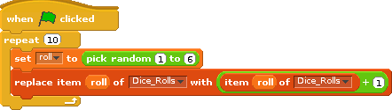
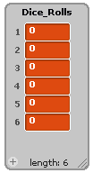
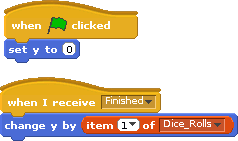
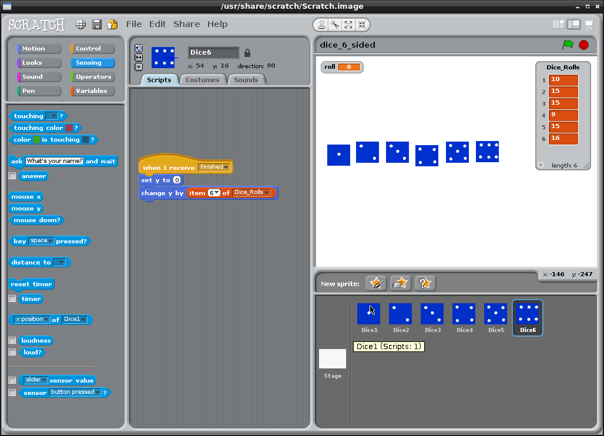

# Introduction

We are going to use extend the dice shaker. Scratch will pick a random number between 1 and 6 and we will store the number of times each number appears. We are going to store the total number of rolls  in our list and then use the data inside the list to calculate the mean, median and mode of the dice rolls.

# Step 1: Random number generator

## Activity Checklist

+ Load the 6 sided dice roll from last week. ☐
+ The code should look something like: ☐

## Test your project

We should check our code from last week still works. Click the green flag.

+ Do you get the expected *distribution* of dice rolls? _______________

## Save your project

# Step 2: Calculate the mean.

To calculate the mean,  we add all the rolls we have made up and then divide by the number of rolls. e.g. we roll a 5, a 1 and a 3. The mean is 5 + 1 + 3 divided by 3 = 9/3 =  3.

## Activity Checklist

+ Create a new value called number_of_rolls for all Sprites.
+ Click on the stage icon and make the code look like the following:

## Test your project

Click the green flag.

+ What is the mean value. Is this reasonable? __________________
+ What happens if we change the number of rolls to 1000.

## Save your project

# Step 3: Calculate the mode

The mode is the value which occurs most often. For example if we roll (1,1,1,4,4,5,5,6,6) then the mode would be 1 as that occured 3 times.

## Activity Checklist

+ Add this piece of code to the *Stage* scripts.

## Test your project
## Save your project

A list allows objects to be stored inside a big structure. Think of it like a fabulous coat with thousands of pockets. You can put water in one pocket, sweets in another, maths homework in another, your dog in another, a caravan in another, an ant in another, a large number in another. We are just going to use 6 pockets and going to store numbers in them. Each of the 6 pockets will contain the total number of dice rolls we have seen for that number (e.g. we have seen number 1, 3 times, so we put the number 3 into the pocket labelled 1).

Ask your teacher to demonstrate the dice and cups sorter.

## Activity Checklist

+ Make sure you are still clicked on the Background tab.
+ Create a list called Dice_Rolls underneath lists in the Orange variables blocks list. Make sure Dice_Rolls applies to all sprites.
+ Modify the code so that it looks like the following.

+ Click on the + inside the stage area of the screen until 6 boxes are shown. The + icon is next to the length in bottom left corner of the grey box. See screenshot below.  This shows totals for how many rolls of each of 1,2,3,4,5 and 6 have been observed.

## Test your project

Click the green flag.

+ How do this code work? The code in the list works by taking the item at position (1 to 6) and increasing it by one.
+ How many 1's did you roll [ ]? How many 6's did you roll [  ]. Is this what you would expect?
+ How many 6's would you expect to roll if you increased the repeat value to 100? Why would it be a good idea to use 100 rolls instead of some other number ?
+ What happens when you click the green flag twice. We need to fix this:

## Test your project

Click the green flag.

+ Does this fix the project?
+ How many even numbers did you roll? Is this what you expected?

## Save your project

# Step 5: Extension. Draw a graph of the probability.

We can draw a simple graph in Scratch using the X and Y position system (co-ordinates)

## Activity Checklist

+ Modify a sprite, giving it an appropriate costume.
+ Line up the sprites horizontally such that each one is equally spaced.
+ Check that the following code is used for the stage:

+ When the game is finished (we are outside of the repeat 100 loop), then the stage broadcasts "Finished". If the sprite is listening for "Finished" it can move itself vertically. Ensuring that you are clicked on the Sprite, use the following code:

+ Duplicate the sprite, dragging it's position horizontally and then changing the Script to say item to 2 instead of 1. 
+ Repeat the process for 3,4,5 and 6. You should now have 6 sprites.

## Test your project

Click the green flag.

+ Do the sprites move vertically up ?
+ Does the graphical result reflect the numbers in the list?

## Save your project 

# Step 6:  Extension work: Extend to two dice

It is possible to extend this to two dice, adding the total on each dice together. For example 6 + 6 = 12. We would increase our 12 score by 1.

You will need to extend the list to have up to 12 items in and you will need to zero all the boxes (not just 6). You do not have to worry about graphing all combinations. 

## Test your project

Click the green flag.

+ What is the most likely number from rolling two dice? 
+ Increase the number of rolls to 1000, what is the most likely number now?

# Step 7:  Extension work: Cheating

Examine the below code. What does it do?

## Test your project

Click the green flag.

+ What is the most likely number to be rolled?  Why? Would someone be able to spot that the dice was loaded? Why?
+ What would happen if the random number was selected between 1 and 10 instead of 1 and 7? Why?
