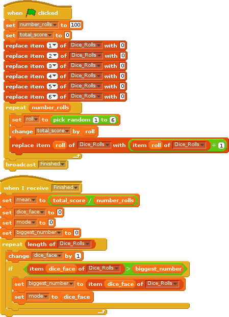
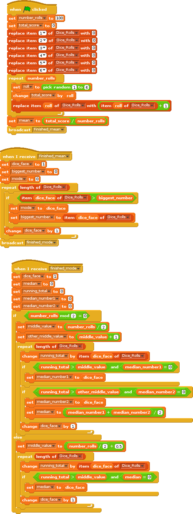

# Introduction

Extend the dice shaker from last week, we will investigate the mean, median and mode of a six sided dice thrown many times. Scratch will pick a random number between 1 and 6 and we will store the number of times each number appears. We are going to store the total number of rolls  in our list and then use the data inside the list to calculate the mean, median and mode of the dice rolls.

# Step 1: Random number generator

## Activity Checklist

+ Load the 6 sided dice roll from last week. ☐
+ The code for the *Stage* should look something like: ☐

## Test your project

We should check our code from last week still works. Click the green flag.

+ Do you get the expected *distribution* of dice rolls? _______________

## Save your project

# Step 2: Calculate the mean.

To calculate the mean,  we add all the rolls we have made up and then divide by the number of rolls. e.g. we roll a 5, a 1 and a 3. The mean is 5 + 1 + 3 divided by 3 = 9/3 =  3.

## Activity Checklist

+ To get the total score for all rolls, we create a variable *total_score* for all sprites. ☐
+ To get the total number of rolls, it's easiest to store the value in a variable which we can then use and reuse in our scripts. Create a new value called *number_rolls* for all Sprites. ☐
+ Finally create a variable *mean*. ☐
+ Click on the stage icon and make the code look like the following: ☐

## Test your project

Click the green flag.

+ What is the mean value. Is this reasonable? __________________
+ What happens if we change the number of rolls to 1000._________________
+ If you used the cheating code last week, you could add the same code and find out the mean. ☐

## Save your project

# Step 3: Calculate the mode

The mode is the value which occurs most often. For example if we roll (1,1,1,4,4,5,5,6,6) then the mode would be 1 as that occured 3 times.

## Activity Checklist

+ Create a variable *dice_face* which is used to count up the number of items in our list. ☐
+ Create a *sum_dice_sides* variable which will be used to add the number on each face of the dice. ☐
+ Create a variable *mode* used to store the mode. ☐
+ Create a variable biggest_number which is used to store the biggest number of times this has been rolled. ☐
+ Add extra code to the *Stage* scripts. You should have this code in addition to the code to calculate the mean up above. ☐

## Test your project

Click the green flag.
+ What is the mode? ________________
+ Increase the number of rolls to 1000, what is the mode now?
+ How does the mean compare to the mode for a 6 sided dice? ____________________

## Save your project

# Step 3: Extension: Calculate the median

The median is the middle value (e.g. the median of rolls 1,3,5 is 3 and the median of 1,3,5,7 is 4). To calculate the median of our rolls, we need to store all the values, sort them and then find the middle one. We have of course already sorted and stored all rolls in the list *Dice_Rolls*. What we need to do is find the mid-point of this list. We can find the mid-point by calculating a *cumulative total* - adding up the numbers of rolls. Once the cumulative total is greater than 50 we know which Dice number was the median.

|  Dice Number  | Cumulative Rolls|
|---------------|-----------------|
|      1        |                 |
|      2        |                 |
|      3        |                 |
|      4        |                 |
|      5        |                 |
|      6        |     100         |

## Activity Checklist

+ Fill in the above table adding up the number each time to your total (e.g. we saw 1, 18 times 2 19 times so we add 18+19 = 37 we then add the number of times we saw 3 and so on...). The median is reached when you cross the mid-point (the mid point of 100 items is between the 50th and 51st item).
+ What is the median? _______________________

## Test your project

Click the green flag.

+ How does the median compare to the mean? _________________________
+ Are you happy with the result?_______________________ Why?__________________________________________________________________________

## Save your project

# Step 3: Extension: Mean, Median and Mode of the cheating dice.

If you used the cheating dice last week which rolls a 6 more often than it should, then you can apply the same code above to those programs.

What will happen to the mode? ______________________
What will happen to the mean? ______________________
What will happen to the median? ______________________ Why?  _______________

# Step 4: Extension: Mean, Median and Mode of the two dice.

If you calculated the sum of two dice last week, then calculate the mean, median and mode of two dice by applying the code above to both dice.

What is the mode of the sum of two dice over 100 rolls? ______________________
What is the mean of the sum of two dice over 100 rolls ? ______________________

# Step 4: Challenge: Calculating the Median Programatically.

It is of course possible to calculate the median programatically in the same was as we calculated the median in the table we made earlier. Here is the code which can do it. This code is obviously complicated as it needs to know whether the list is an odd number or an even number long, before it can calculate the median from the cumulative totals. You are not expected to enter this code, but can use the code rolled earlier.

## Activity Checklist

+ Open the dice_6_sided_mean_median_mode.sb ☐
+ Run the code. ☐
+ How does the median compare to the mean? _________________________
+ Are you happy with the result?_______________________ Why?__________________________________________________________________________
+ Can you understand how the code works?________________

## Save your project

